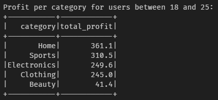

## Домашнє завдання. Аналіз даних у PySpark

### 1. Завантажте та прочитайте кожен CSV-файл як окремий DataFrame.

### 2. Очистіть дані, видаляючи будь-які рядки з пропущеними значеннями.

### 3. Визначте загальну суму покупок за кожною категорією продуктів.

### 4. Визначте суму покупок за кожною категорією продуктів для вікової категорії від 18 до 25 включно.

### 5. Визначте частку покупок за кожною категорією товарів від сумарних витрат для вікової категорії від 18 до 25 років.

### 6. Виберіть 3 категорії продуктів з найвищим відсотком витрат споживачами віком від 18 до 25 років.

